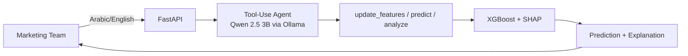

# AI-Powered Churn Prediction Chatbot

A PoC for predicting customer churn via an LLM-powered chatbot. The marketing team interacts in natural language (Arabic/English), and the system predicts churn probability with explainable insights.

## Architecture



See [docs/architecture.md](docs/architecture.md) for detailed diagrams.

## Quick Start

### Prerequisites
- Python 3.10+
- [Ollama](https://ollama.ai) installed and running
- GPU with 4GB+ VRAM recommended (runs on CPU too)

### 1. Install Dependencies

```bash
uv venv .venv
source .venv/bin/activate  # Linux/Mac
# .venv\Scripts\activate   # Windows
uv pip install -e ".[dev]"
```

### 2. Pull the LLM Models

```bash
ollama pull qwen2.5:3b
ollama pull qwen2.5:1.5b
```

### 3. Train the ML Model

```bash
python -m src.train
```

This produces model artifacts in `models/` (~2-3 min on CPU).

### 4. Start the API

```bash
uvicorn api.main:app --host 0.0.0.0 --port 8000
```

### 5. Use It

Open http://localhost:8000 for the chat UI, or use the API directly:

**Chat endpoint:**
```bash
curl -X POST http://localhost:8000/chat \
  -H "Content-Type: application/json" \
  -d '{"session_id": "demo-1", "message": "Assess this customer: married, 24 months tenure, fiber optic, month-to-month contract, $85 monthly, electronic check, $2040 total, online security yes, tech support yes, no streaming, no device protection, paperless billing, phone service, not senior, has dependents, no online backup"}'
```

**Direct prediction:**
```bash
curl -X POST http://localhost:8000/predict \
  -H "Content-Type: application/json" \
  -d '{"Senior_Citizen":0,"Is_Married":"Yes","Dependents":"Yes","tenure":24,"Phone_Service":"Yes","Internet_Service":"Fiber optic","Online_Security":"Yes","Online_Backup":"No","Device_Protection":"No","Tech_Support":"Yes","Streaming_TV":"No","Streaming_Movies":"No","Contract":"Month-to-month","Paperless_Billing":"Yes","Payment_Method":"Electronic check","Monthly_Charges":85,"Total_Charges":2040}'
```

**API docs:** http://localhost:8000/docs

### Docker

```bash
docker-compose up
```

## Project Structure

```
src/
  config.py           # Central configuration
  schemas.py          # Pydantic models (shared contract)
  preprocessing.py    # sklearn pipeline
  train.py            # Model training with Optuna
  predict.py          # Prediction service (ONNX runtime)
  analytics.py        # Dataset analytics engine
  chatbot/
    prompts.py        # System prompt (bilingual)
    session.py        # Chat session management
    chain.py          # Tool-use agent orchestration
api/
  main.py             # FastAPI application
  routes/             # API endpoints
tests/                # Test suite (40 tests)
docs/                 # Documentation
static/               # Chat UI
```

## Model Performance

| Metric | Score |
|--------|-------|
| Recall | 0.81 |
| AUC-ROC | 0.85 |
| F1 (churn class) | 0.64 |

## Tech Stack

- **ML**: XGBoost (ONNX), scikit-learn, SHAP, Optuna
- **LLM**: Qwen 2.5 3B + 1.5B fallback via Ollama (fully local, open-source)
- **API**: FastAPI + LangChain
- **Language**: Python 3.10+

## Documentation

- [Architecture Diagram](docs/architecture.md)
- [Technical Report](docs/technical_report.md)
- [Marketing Team Usage Guide](docs/usage_guide.md)

## Tests

```bash
python -m pytest tests/ -v
```
