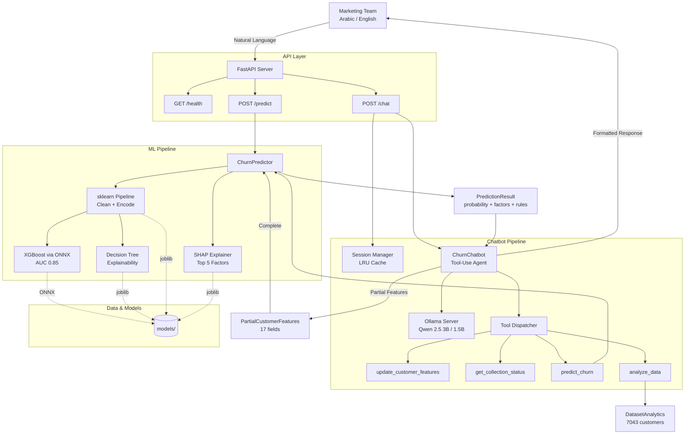
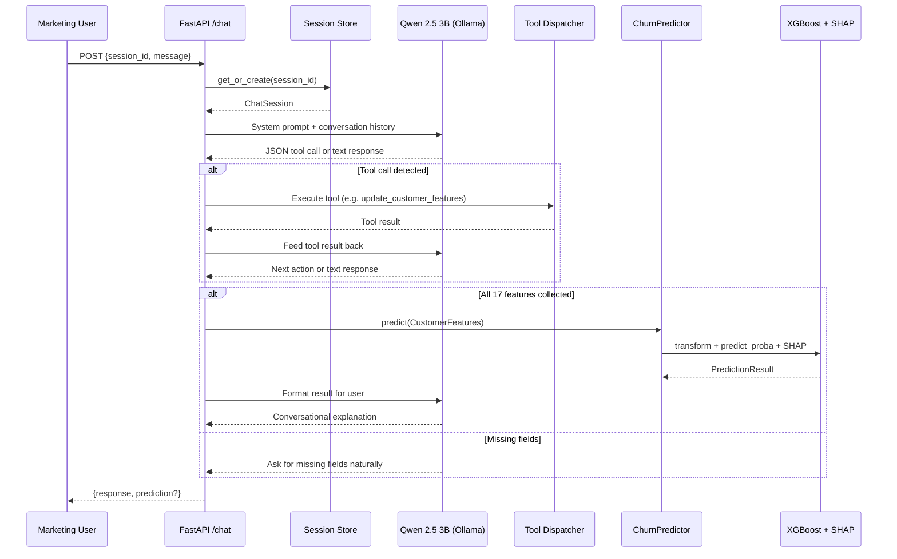

# System Architecture

## High-Level Architecture

## Data Flow - Chat Interaction

## Component Details

| Component | Technology | Purpose |
|-----------|-----------|---------|
| API Server | FastAPI + Uvicorn | REST API with auto-generated docs |
| LLM | Qwen 2.5 3B via Ollama (primary), Qwen 2.5 1.5B (fallback) | Tool-use agent for conversation + extraction |
| ML Model | XGBoost via ONNX Runtime | Churn probability prediction |
| Explainability | SHAP + Decision Tree | Per-prediction and global explanations |
| Analytics | DatasetAnalytics | Historical churn pattern queries |
| Preprocessing | sklearn Pipeline | Reproducible feature engineering |
| Session Management | In-memory LRU dict | Multi-turn conversation state |
